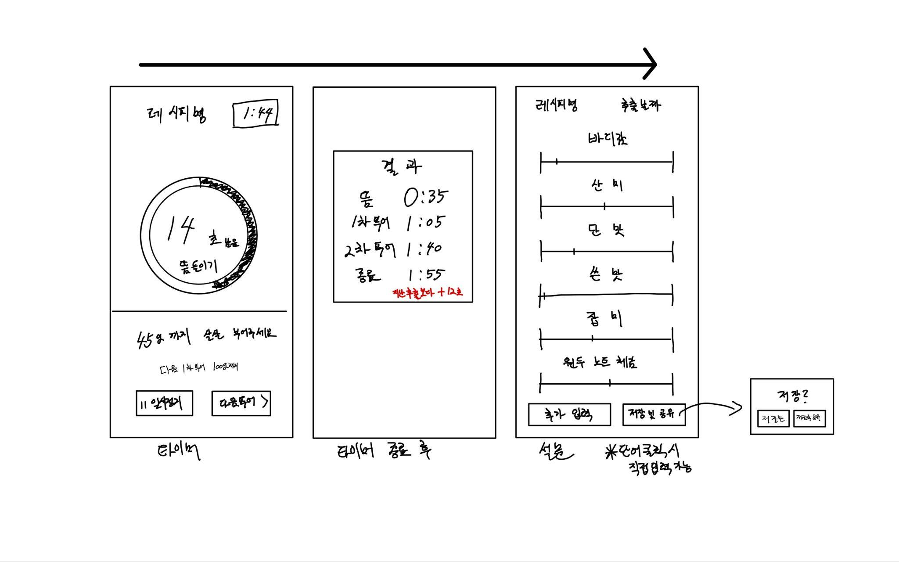

2026-2
임베디드 시스템 및 실습 01
Agentic Coding (NextBrew)
개발 보고서
V1

## 1. 앱 개발 동기 (NextBrew - 빠짐없이 남기는 핸드드립 추출 기록 앱)

### 개발 동기
매일 커피를 내리고 시음 기록을 AI 에이전트에 구어체로 적어 데이터화하는 도중에 날짜가 누락되거나 요소가
제각각으로 기록되는 일이 있었습니다. 이렇게 정형화되지 않은 상태로 저장되어 일부 내용이 누락되는 경우가
있었습니다. 이를 계기로 체계적으로 저장하여 유의미한 데이터를 얻고자 합니다.
비교해야 할 최소한의 확인된 변수가 8개(원두, 분쇄 클릭(분쇄도), 온도, 뜸, 원두와 물의 비율, 총 물량, 물을
원두에 드립하는 양상, 추출 시간)라 기억으로 비교하기에는 변수가 많습니다.
또한 커피의 맛은 사람마다 상대적이며 노트라고 불리는 표현 방식에서도 사람마다 초기에 명칭을 매칭해 보지
않으면 일반적인 표현에서 벗어날 수 있어서 기록장 방식의 앱에는 부족함을 느꼈습니다.

### 이미 존재하는 앱의 기능
이미 유사한 앱이 존재합니다. 타이머나 원두 상세 선택, 맛을 통한 원두 추천을 하고 데이터를 AI에 공유하는
앱까지 존재하지만, 보통 영어권에서 개발되어 한국어가 지원되는지 불명확하며, 대부분 애플 앱스토어에만
출시되어 안드로이드 사용자는 사용하지 못하는 경우가 많습니다.
하지만 NextBrew는 세밀하게 타이머를 설정하고 자동 저장하도록 하는 기능을 주력으로 웹앱으로 만들어
기기간 제약을 완화할 수 있다는 차별점이 있습니다.

## 2. 해결을 위한 아이디어 목록

| 구분 | 내용(이유) |
|---|---|
| 가 | 수기 기록 (번거로움, 누락가능성 높음) |
| 나 | 기존 커피 앱 기록 (기록장 형식으로 데이터 정리(공유)가 번거로움, 영문, 대부분 앱스토어 출시) |
| 다 | 스프레드시트를 이용한 기록 (수기 기록과 차이 미미함) |
| 라 | [현 사용 방식] 구어체를 이용한 AI 에이전트 기록화 (누락 여지 존재, AI 사용량 압박, 자유도 높음) |
| 마 | 내 기준에 맞춘 앱 개발 (에이전트 소급 적용으로 사용량 압박 완화 및 데이터 정형화 저장, 입력 부담 적음) |

아이디어 결론: 상기의 이유로 ‘마’를 채택하였습니다.

### 선택 근거(상세)
* 세밀한 타이머 + 자동 저장 + 웹앱이 다른 앱들과의 차별점이며, 공유 기능은 일부 중복됩니다.
* AI를 API로 미탑재할 예정입니다. 조언을 구하는 구간을 앱에 넣으면 경계가 모호해지고,
AI 기능 앱은 이미 존재합니다. 또한 AI를 임의로 도입하여 API로 이용한다면
AI 모델이 한정적일 수밖에 없으며, 과금 문제와 AI 선택의 폭이 좁아집니다.
추가로 이미 개인적으로 구축해 두었던 에이전트를 활용하는 것도 가능해집니다.

## 3. 주요 기능

### 추출 레시피
* 이미 존재하는 레시피를 앱 내부에 프리셋으로 탑재.
* 추가로 형식을 맞추어 커스텀 레시피를 추가
* 이미 존재하는 레시피를 불러와 커스텀으로 일부 수정하는 방식 도입

### 타이머
* 타이머 시작과 종료 버튼으로 시간을 측정하여 자동으로 타이머 시각이 저장되게 구현.
* 타이머 동작 후 버튼을 통한 단계별 전환으로 단계별 시간 추적이 가능하게 하여
좀 더 명확한 데이터를 확보

### 기록 입력 (방식)
* 타이머를 통해 나오는 데이터를 시간과 함께 저장한 후, 커피를 마신 뒤 저장되어 있는 기록을 열어
설문 형식으로 문항마다 선택지 혹은 임의 입력을 통해 저장.

### 데이터 패키징을 통한 공유 기능 (선택 내보내기)
* 직전 기록과의 차이 비교나 범위 지정을 통해 추출했던 커피의 데이터를 묶어
특정한 형식의 파일로 공유 가능하게 구현.

### 그라인더 영점 관리
* 그라인더의 영점이 표기와 다른 경우 “OO 그라인더 - 110(-3)클릭”의 방식으로 표기되도록 구현 예정.
* 분쇄도 크기 측정값 보조 사용
클릭은 상대적이므로 알아보고 싶다면 “언스페셜티 - 분쇄도 가이드”를 이용하여
μm(마이크로미터) 단위를 통해 클릭별 분쇄된 원두의 크기를 단위로 저장할 수 있도록 구현 예정.

### 자동저장 기능
* 타이머 종료 시 자동 기록 저장 (데이터 유실 방지)

## 4. UI 묘사

### UI 묘사 해설 내용
* 타이머 화면
남은 시간과 현재 진행 “푸어(물 붓기)”를 설명하는 화면,
직관적으로 어느 g까지 맞춰야 하는지 표시하며, 일시정지와 다음 “푸어(물 붓기)” 진행, 종료가 가능합니다.

* 추출 종료 화면
타이머 종료 이후 결과값이 정형화된 값으로 뜨며 저장되고,
JSON 혹은 DB 등의 형식을 갖추어 저장할 예정입니다. 유일한 데이터인 타이머의 차이 또한 표시할 예정입니다.

* 커피를 마신 후의 설문 화면
레시피와 원두 표시, 타이머 결과값, 단계형 슬라이더 형식에 묘사 단어를 넣어 이용,
특징적이거나 슬라이더 외의 정형화되지 않은 설명은 추가 입력을 통해 저장할 수 있게 하여
사용자의 다양한 표현을 제한 없이 이용 가능하게 할 예정입니다.

* 설문 화면의 저장/공유 기능
설문 안에서 팝업 스타일로 저장만 하거나 저장 후 공유 기능을 이용할 수 있습니다.
공유 기능을 이용하면 JSON이나 MD(마크다운) 형식을 이용하여 프롬프트나 세부적인 추출 기록을 저장하고,
AI에게 질의하기 위한 묶음 형태로 단일 기록을 전달할 수 있습니다.

## 5. 사용자 시나리오 (사용 흐름)

### 기본 사용 환경 (추출할 때)
1. 원두를 갈기 전에 앱을 켜고 레시피를 고릅니다.
2. 타이머를 따라 커피를 추출합니다. 화면은 켜진 채로 유지됩니다.
3. 추출이 끝나면 추출한 데이터가 저장됩니다.
4. 커피를 마신 뒤나 마시는 상황에서 떠오른 조건을 확인하고, 맛 설문을 선택하거나 직접 적습니다.
(다시 열어 변경이 가능합니다.)
5. 저장하면 직전에 추출된 커피와 현재 추출된 커피의 타이머 기준 추출 차이가 바로 뜨며,
설문 후에는 설문 내용과 추출 데이터 모두 이전 추출과 현재 추출 간의 수치 차이를 보여줍니다.
(직접 적은 부분은 차이와 관계없이 모두 표시될 예정입니다.)

### 이외의 사용 환경
* 맛이 이상할 때: [AI로 공유]를 눌러 질문과 데이터 묶음(특화된 프롬프트 삽입)을 복사하고,
AI에 붙여넣어 원인을 묻습니다.
* 원두를 등록할 때: [원두 등록]을 통해서 현재 사용하고 있는 원두의 종류(정보)를 등록합니다.
* 원두별 기본 레시피 지정: [고정 레시피]로 여러 기록을 종합해, 해당 원두를 선택하면
이 레시피가 기본으로 선택되게 합니다.
* 이전 추출 방법 유지: 직전 추출 원두, 레시피 등을 유지하여 연속성 있게 개선하거나 동일하게 추출을 할
수 있게 합니다.

## 6. 구현 항목별 세부 결정사항 및 고려사항

| 항목 | 결정사항 | 고려사항 |
|---|---|---|
| 형태 | 웹앱(PWA) | 타이머 작동 중 화면 꺼짐 방지 등 기능 확인 필요 |
| 배포 | GitHub Pages (Repo 이용 방식) | 공개 상태에서 사용 시 보안 기능 고려 필요 |
| 저장/공유 | JSON, MD 내보내기/가져오기 (계획) | 패키징 방식 및 가이드라인 데이터 프롬프트 등 요소 미정, 데이터 저장 위치 미정 |
| 타이머 | 시작 시각 기준 계산, 동작 중 화면 꺼짐 방지 |  |
| 입력항목 | 그라인더 기준 클릭 방식 분쇄도 이용 (예: 115(-3) 보조로 μm 측정값 입력), 원두, 온도, 비율, 물량, 드립 양상(방법), 시간 + 맛 설문 + 추가 내용 | 각 세부적인 기준, 수치 등 미정 |
| 기록 | 사용 중 버튼 입력으로 자동 저장 방식 및 이후 맛 표현 설문 방식 기록 |  |
| 제외 | 앱 내부 AI API 호출, 분쇄도 가이드 자체 제공(이미 완성도 높은 사이트 존재) X |  |
| 미정 | 설문 세부 문항, 데이터 저장 위치 등 다수 |  |

## 7. 향후 과제 및 개요
* V1에서는 개요 수준으로 작성되었으며, 진행 상황별로 작성 예정.

### 개발 일정

| 단계 | 일정(예정) | 목표 |
|---|---|---|
| 주제 발표 V1 | 9/18(금), 9/22(화) | 문제 정의, 기능 범위, 사용자 시나리오, UI 초안 |
| 중간 발표 V2 | 10/2(금), 10/6(화) | 타이머, 기록 입력, 프로토타입 시연, 실사용 기록 |
| 최종 발표 | 10/23금 10/30(금) | 중간 발표와의 비교, 사용 결과 및 셀프 피드백 |

### AI 가이드라인 (Agentic Coding 공지 9.21 기준)
* 1. AI 사용 불가
    * 문서/발표자료 '내용'
    * 구조도/다이어그램/흐름도 등
* 2. AI 사용 가능
    * 코딩(최대한 활용)
    * 차트/그래프
    * 실사/만화풍의 정교한 그림(일러스트 - 굳이 필요하다면?)
    * 문서 작성 가이드(전체적인 구성 등에 대한 조언)

### 기록 요소 및 참고 항목
* 설계: 데이터 구조와 화면 구성의 결정 과정 기록
* 디버깅: 발생한 문제와 해결 과정 기록 (트러블 슈팅)
* 편의성 개선: 사용 중 불편을 개선한 내역 기록

* 사용 기록 및 문서화:
    * 세션 원문의 대화 기록을 파일로 저장하는 방식 이용 예정.
    * 공유 기능으로 URL이 생성되는 방식은 인터넷에서 접속 가능한 접점이 생겨
검색엔진에 노출될 수 있어 사용하지 않을 예정이며, 자세한 방식은 미정.

* [공지 내용] 도전 과제: 실사용 서비스 개발 및 운영(성적 A+ 부여)

### 중간 보고 (V2)
* 프로토타입 개발 현황과 시연 내용, 사용 기록(존재하는 경우)
* 현재까지의 실제 사용 경험(기록 횟수, 일부 내역 등)

### 최종 보고
* 최종 버전 결과물
* 설문조사(공지 내용 존재)
* 셀프 피드백:
    * 불편했던 점(개선한 점)
    * 잘한 점과 잘못한 점
    * 전체 소감 및 AI를 쓰며 더 공부할 점 등
* 향후 이뤄지지 않은 앱(웹) 개선 방향 제시

### 부록
* 제작 기록:
    * 보고서
    * 에이전트 대화 원본 저장본
    * Commit 이력(GitHub Repo 이용 예정)
* 수정 기록:
    * 기능 변경 내역과 이유 작성 문서
* 사용 기록:
    * 앱(웹)에서 내보낸 추출 기록, Log 파일
